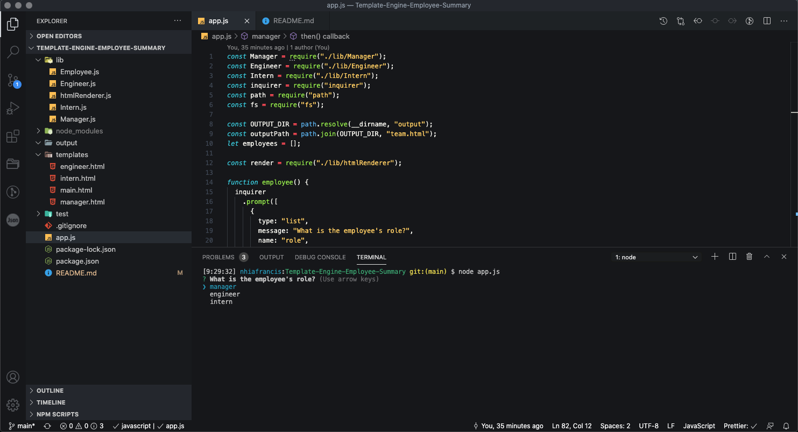
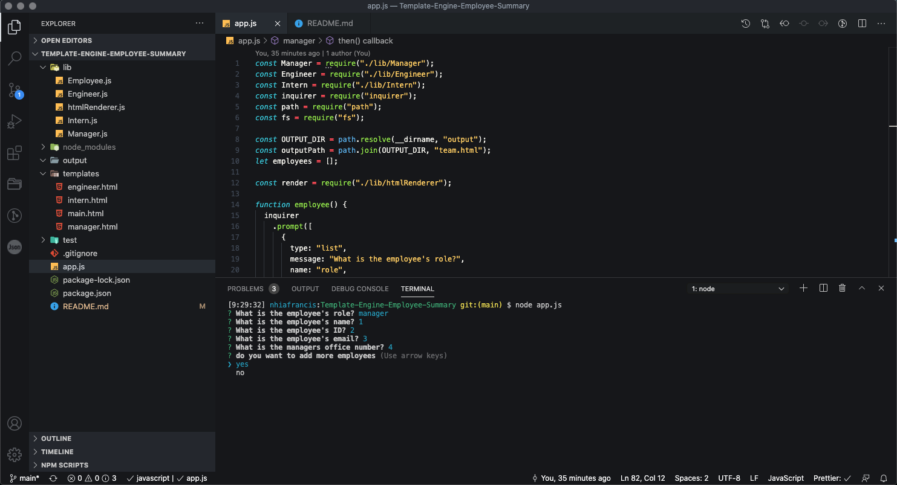
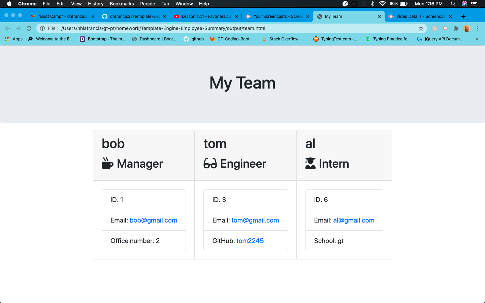

# Template-Engine-Employee-Summary

**Description**

This is a command line application that generates a html file based on user input. The app creates employee cards with their specific information. The cards are displayed via html.

**Installation**

Clone the project from Github. In VS Code from the terminal run node app.js and follow the prompts.

**Usage**

When you run node app.js you are prompted answer questions about each employee. Their role, name, ID, and email. You will also be asked questions specific to each employee such as office number for manager, github for engineer and school for intern. 

When you have finished answering the questions for one employee, you will be asked if you want to add another employee. 

When you have finished adding all of you employees the app will create a html page containing cards for each employees and there information.

**License**

MIT License

Copyright (c) [2020] [Dennis Francis]

Permission is hereby granted, free of charge, to any person obtaining a copy
of this software and associated documentation files (the "Software"), to deal
in the Software without restriction, including without limitation the rights
to use, copy, modify, merge, publish, distribute, sublicense, and/or sell
copies of the Software, and to permit persons to whom the Software is
furnished to do so, subject to the following conditions:

The above copyright notice and this permission notice shall be included in all
copies or substantial portions of the Software.

THE SOFTWARE IS PROVIDED "AS IS", WITHOUT WARRANTY OF ANY KIND, EXPRESS OR
IMPLIED, INCLUDING BUT NOT LIMITED TO THE WARRANTIES OF MERCHANTABILITY,
FITNESS FOR A PARTICULAR PURPOSE AND NONINFRINGEMENT. IN NO EVENT SHALL THE
AUTHORS OR COPYRIGHT HOLDERS BE LIABLE FOR ANY CLAIM, DAMAGES OR OTHER
LIABILITY, WHETHER IN AN ACTION OF CONTRACT, TORT OR OTHERWISE, ARISING FROM,
OUT OF OR IN CONNECTION WITH THE SOFTWARE OR THE USE OR OTHER DEALINGS IN THE
SOFTWARE.
